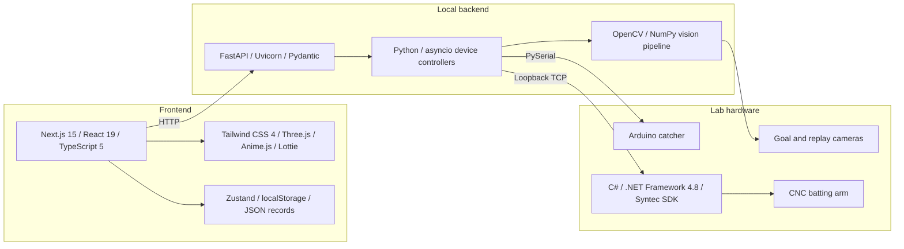

# Particle Collision Simulation

An interactive baseball-themed particle-collision simulator with a local hardware-control stack for cameras, a catcher, and a CNC-driven batting arm.

## Project status

This repository is a curated snapshot assembled from three private development repositories. Their Git histories are intentionally not included because the source repositories contain private operational material.

The application code is preserved as originally used on a local lab machine. The browser simulation can be explored without physical equipment, but the backend and hardware code must not be started on an unreviewed machine: it contains operational behavior and machine-specific configuration from the original installation.

## Project team

This project was created as a term project for the exhibition [*Seeing the Wonder of Molecular Encounters*](https://www.ntsec.gov.tw/article/detail.aspx?a=5751), held at the [National Taiwan Science Education Center](https://www.ntsec.gov.tw). It was initiated and funded by the [Yuan T. Lee Foundation for Science Education](https://www.ytlee.org.tw), and directed by Dr. Jim Jr-Min Lin, Research Fellow at the [Institute of Atomic and Molecular Sciences, Academia Sinica](https://www.iams.sinica.edu.tw), with guidance from professors at the [Department of Computer Science and Information Engineering](https://www.csie.ntu.edu.tw) and the [Department of Mechanical Engineering](https://www.me.ntu.edu.tw) of [National Taiwan University](https://www.ntu.edu.tw). The project was developed together with my teammates from the Department of Mechanical Engineering at NTU: 鄧亦宸, 林哲安, 陳彥鈞, and 陳鼎云. The robotic arm was sponsored by [SYNTEC Technology Co., Ltd.](https://www.syntecclub.com)

## Features

- Interactive Next.js simulation inspired by crossed molecular beam experiments
- Baseball target selection, hit/miss feedback, and local statistics
- Optional FastAPI service for arm, catcher, goal-camera, and replay-camera control
- Arduino catcher firmware
- Loopback-only C# bridge for a Syntec CNC controller
- Original local hardware integration retained as an archival implementation reference

## Tech stack



Versions shown above come from the committed manifests. The Syntec SDK is a separately licensed local dependency and is not included in this repository.

## Repository layout

| Path | Purpose |
| --- | --- |
| `frontend/` | Next.js user interface and browser simulation |
| `backend/` | FastAPI hardware orchestration service |
| `hardware/baseball-arduino/` | Arduino catcher firmware |
| `hardware/arm-server/` | Windows/.NET Framework CNC bridge source |

The original private repositories are intentionally excluded by the root `.gitignore` and are not part of this public snapshot.

## Quick start: browser simulation

Requirements:

- Node.js and npm

```bash
cd frontend
npm ci
npm run dev
```

Open <http://localhost:3000>. The hardware status may show as unavailable when the backend is not running; the browser simulation remains usable.

## Local backend snapshot

Requirements:

- Python 3.10 or newer
- The original compatible cameras, serial devices, and CNC bridge

```bash
cd backend
python3 -m venv .venv
source .venv/bin/activate
python -m pip install -r requirements.txt
uvicorn server:app --reload
```

Do not run this command unless the original lab hardware and safety controls are available. Starting the backend initializes controllers and sends startup commands to the arm. See [backend/README.md](backend/README.md) first.

## Hardware safety

This software can send commands to physical equipment. Review and test the emergency-stop procedure before running the backend.

- The original code automatically initializes devices and configures the arm during backend startup.
- The original built-in backend launcher listens on all interfaces and has no authentication layer.
- Keep the stack on the original isolated lab network; it is not an Internet-facing control plane.
- The Syntec SDK and vendor examples are not redistributed here. Supply a licensed local SDK when building the arm bridge.

## Checks

```bash
cd frontend
npm run lint
npm run build

cd ../backend
python -m compileall .
```

The preserved backend passes Python syntax compilation but is not currently Black- or Flake8-clean. It is intentionally not reformatted in this display snapshot. Hardware-dependent behavior must be tested only on the original isolated lab system after the device configuration and safety controls have been reviewed.

The preserved dependency versions are also unsuitable for a new Internet deployment without a fresh security review and upgrade. This repository is intended for source display and local archival use.

## License

Licensed under the [MIT License](LICENSE). Copyright (c) 2026 Derek Lu.

The project owner has confirmed redistribution rights for the media in `frontend/public/`. Proprietary Syntec SDK binaries and vendor examples are not included.
